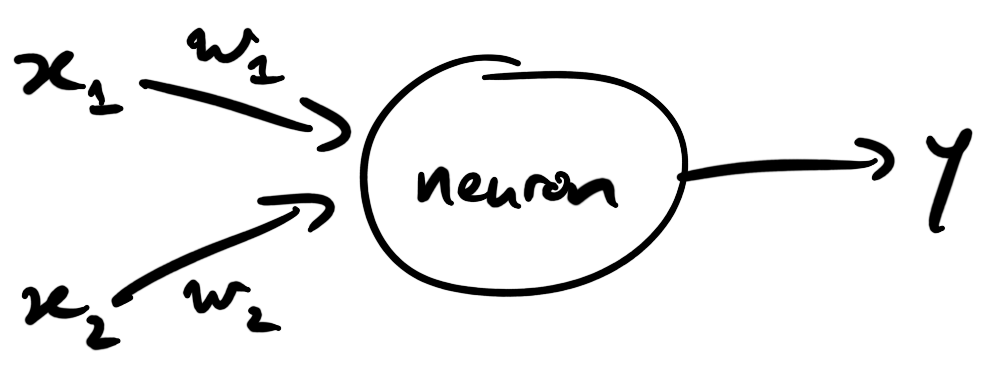
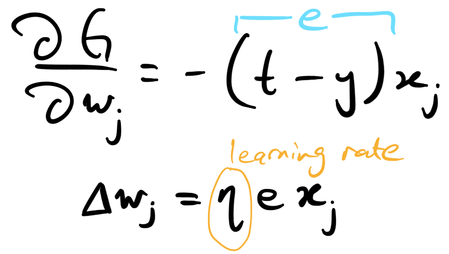
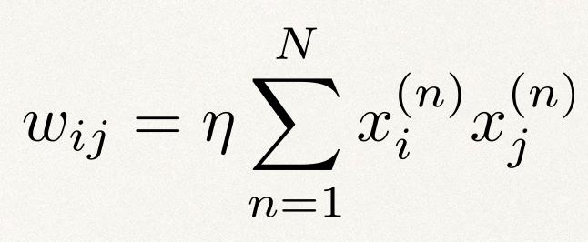
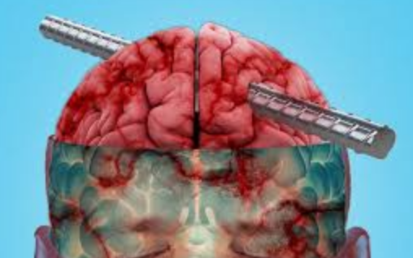

# PHYS3888 Tutorial: Building Learning Machines

This tutorial will walk you through some core concepts in artificial intelligence.

## Part 1: Classification with a single neuron

### Weight space of a single neuron

Recall that a sigmoidal function can be used to map a neuron's activation to its output (remember when we saw this in the Dynamical Systems Tutorial?).
Let's first get an intuition for how neuronal activation maps to neuron output for a set of inputs, `x`:


Write an inline function, as `y = @(x,w) ...`, that implements this nonlinear function for scalars `x` and `w`.

Can you adjust this function to work for the convention used in this tutorial: `w` is a row vector and `x` is a column vector?

:question::question::question:
Check that you have implemented this function correctly by evaluating for `x = [1;1]`, `w = [2,-1]` as:

```matlab
x = [1; 1];
w = [2, -1];
y(x,w)
```

### The one-dimensional neuron


Consider the case where our model neuron has a single input, `x`.
Then we have just a single degree of freedom in determining neuron's response to that input, through the scalar weight, `w`.
Plot `y` as a function of `x` for some different values of the weight parameter, `w`, sampling both positive and negative values.

* What happens when `w = 0`?
* How does a higher weight magnitude shape the neuron's response to the same input?
* For the same weight magnitude, what does flipping its sign do to the neuron's response to the same input?

### The two-dimensional neuron

Let's now imagine that we have a two-dimensional input space.
Now we have the freedom to set/learn two numbers, `w = [w1,w2]`, which determine the neuron's response to its two inputs, `x = [x1,x2]`.



Recall that each point in weight space (defined by two numbers, `[w1,w2]`), now defines a unique function of the two inputs, `[x1,x2]`.
Let's try looking at some of these possible neuron responses as a function of its inputs, at different points in weight space.


We can plot these surfaces by setting `w`, and then computing the function `y` across a grid in `x1` and `x2`.
Take a look at the function `plotNeuronResponse` and verify that you understand how it does these steps.

Then take a look at some surfaces by first setting `w` and then running `plotNeuronResponse` using the `y` function you coded above.
For example:

```matlab
w = [1,-1];
plotAsSurface = false; % turn this off if you prefer to look at an image map
plotNeuronResponse(y,w,plotAsSurface);
```

* When does the neuron tuned to `w = [1,-1]` have minimal output?
Maximal output?
* Plot the neuron response to inputs when `w = [1,0.2]`.
Does the shape of the surface verify your intuition about which input the neuron is more sensitive to?


### Training a single neuron to perform classification

As in lectures, we found that the process of setting weights is akin to learning an input-output relationship.
We took our first steps towards the machine-learning approach, of being able to have this learning process determined automatically from exposing our neuron to enough labeled training data, in a process known as _supervised learning_.

We will consider the case where our poor neuron is forced to predict whether a person is an 'instagram model' or a 'sports star', from two pieces of information:
1. Number of instagram followers
2. Resting heart rate

Suppose we go and survey a bunch of such people and assemble the data as a person by feature matrix, `dataMat`, and a binary vector, `isModel`, that labels each row as representing either a sports star (`0`) or a fashion model (`1`).

Load the data:

```matlab
load('ModelSportData.mat','dataMat','isModel')
```
Have a look at what you have just loaded in.

Use the `scatter` function to plot the data as a scatter, coloring each individual by their `sport`/`model` label:
```matlab
f = figure('color','w');
scatter(dataMat(:,1),dataMat(:,2),50,isModel,'filled');
colormap(cool)
xlabel('Number of instagram followers')
ylabel('Resting heart rate')
colorbar
```

Replot using `dataMatNorm` instead of `dataMat`, which has z-scored the columns of dataMat (use the `zscore` function).
Verify that the _z_-score transformation, which removes the mean and standardizes the variance, puts the two measurements on a similar scale.
This allows us to interpret the relative size of `w` as relative importance scores (independent of the fact that the instagram followers is measured on a vastly different scale to resting heart rate).

Of the two input variables, which one do you think will have higher weight in the trained neuron?

Our information theoretic error metric is implemented in `errorFunction`.
To test your intuition about the relative weights, evaluate the error at a few selected values of `w`.

```matlab
totalError = errorFunction(y,w,dataMatNorm,isModel);
```

At each of 20 random values of `w`, compute the classification error using `errorFunction`, and plot this value as color in a `scatter` plot in `w1,w2` space.
Take your samples from the matrix `wRand = 2*(rand(20,2)-0.5);`
Where in `w1,w2` space are you getting low error values?

:question::question::question: Upload your plot (labeling axes and showing the colorbar).

### Learning from data through incremental updating

Recall from the lecture that, from a given starting point in weight space, we can move in weight space along the direction of maximal decrease in the error function, `G`, to iteratively improve our classification performance.
This will be much more efficient than the random sampling we tried above.

Let's see if our neuron can learn the difference between the two types of people by moving around in weight space.

In the function `IncrementalUpdate`, there is a simple implementation of incremental weight updating, computed for a single point of data.
For a given point in weight space, this evaluates the gradients in response to a single data point, and uses the learning rule in lectures to adjust the weights.
To test the behavior of this rule, we will randomly sample observations in the dataset over and over, and see if this strategy yields a single neuron with a good ability to map the two inputs to our desired output.



Have a quick look at this formula.
How much are the weights adjusted when the neuron makes a prediction equal to the sample's actual label?
What happens when I increase the learning rate, `eta`?

Try starting it somewhere you know is a bad place to start to see if the rule moves you to a good set of weights.

```matlab
% Set a learning rate
eta = ;
% Set initial point in weight space
w0 = ;
numIterations = 100;
IncrementalUpdate(y,dataMatNorm,isModel,eta,w0,numIterations);
```

What is being plotted? Inspect the code in `IncrementalUpdate` if you are unsure.

Where in weight space did the neuron end up? Does the neuron get more accurate at predicting instagram models from iteratively updating its weights?

Between the two variables, what characteristic of the individuals did the neuron learn to pay more attention to?

How does the width of the decision boundary vary over time? Does the neuron get 'more confident'?

Test three learning rates: `eta = 0.02`, `eta = 2`, and `eta = 200` (`w0 = [-1,-1]`, `numIterations = 100`).

:question::question::question: Which of these three learning rates gives the most stable final result within the 100 iterations?

## Part 2: Storing Memories in Hopfield Networks

Recall how a simple Hebbian learning mechanism can allow memories to be stored in networks of connected neurons.

### Defining memories
Let's try to store four memories, corresponding to the letters `P`, `H`, `Y`, `S`, and a checkerboard, into a Hopfield network.
Each neuron is going to be a pixel in 5x5 grid, making 25 neurons in total.
We will be working with a binary Hopfield network, where each neuron's state can be either `-1` (inactive) or `1` (active).

Our first step is to define the memories on our 5x5 grid, which we will implement in the function `defineMemories`.
Plot each of our desired memories, `'P'`, `'H'`, `'Y'`, `'S'`, and `'checker'`, using the `defineMemories` function.
Do you see how the state of the neurons in the network can be used to store useful information?
Cute, huh? :smirk:

Write some code using the `defineMemories` function to represent our five desired memories in a neuron x memory (25 x 5) matrix, `memoryMatrix`.

### Training a Hopfield network

Ok, so we have our memories specified in `memoryMatrix`.
Now let's train a Hopfield network with the Hebbian learning rule to try to store them.

Stare at the Hebbian learning rule for setting weights between pairs of neurons for a bit until your brain is satisfied that it can be implemented as a matrix multiplication of the memories with themselves, as we have stored them in `memoryMatrix`.



This simple step is implemented in `trainHopfieldWeights`, so we can simply compute our set of weights, `w`, as:
```matlab
w = trainHopfieldWeights(memoryMatrix);
```

Have a look at the weights you've just trained using the simple `PlotWeightMatrix` function.

### Inspecting network weights

Our Hebbian rule implemented the intuition that neurons that 'fire together' (i.e., pixels that tend to be on together or off together across the memories), 'wire together'.
Let's check whether this has actually happened.

Take another look at the memories we're trying to store, displayed as a 5x5 grid:
```matlab
f = figure('color','w');
theMemories = {'P','H','Y','S','checker'};
for i = 1:numMemories
    subplot(1,numMemories,i);
    defineMemories(theMemories{i},true);
    axis('square')
    title(sprintf('memory %u',i))
end
```

Note that the neuron indices are distributed across the 5x5 grid as `reshape(1:25,5,5)`.

Looking across the five memories, note down neuron indexes for:
1. Two neurons that tend to be on together (or off together).
2. Two neurons that tend to be anticorrelated (when one is on the other is off and vice versa).
3. Two neurons with no particular synchronization.

For each of these four pairs, predict what the weight will be in the trained Hopfield network (high positive, high negative, or near-zero).
Test your intuition by checking the corresponding trained weights in `w`.
Do the values of `w` for your mirror the patterns in the memories?

Plot a graph containing just the strongest neuron-neuron weights by setting a threshold on `w` (use the `graph` function).
Set a sensible threshold; do the most strongly connected groups of neurons make sense given the memories you defined?
Repeat for the most strongly negatively correlated pairs of neurons.

:question::question::question: Which set of four neurons have states that are most strongly correlated to each other across the five memories?

### Exploring stable states

Ok, so we have trained a binary Hopfield network with a set of five memories, with the result stored in the weight matrix, `w`.
Even better: we understand what the network weights represent.

Now comes the time to test the network's performance in recalling the memories we've fed it.
Let's look at some of the stable states of the trained network, by feeding it lots of random initial states and see what state the neurons settle down to.

Play with the `runHopfield(w,startPoint)` function.
This function simulates the network dynamics, determined by activation rule of individual neurons, and outputs the state of the network when it reaches equilibrium.
Verify that you can run the code with a random starting point.

Fill your code for setting a random starting point into the code below, and inspect the types of equilibrium states our trained network has:
```matlab
numRepeats = 20;
f = figure('color','w');
for i = 1:numRepeats
    startPoint = ; % FILL IN A RANDOM MEMORY
    [finalPoint,numIters] = runHopfield(w,startPoint);
    subplot(4,5,i);
    imagesc(reshape(finalPoint,5,5));
    axis('square')
    colormap(flipud(gray))
end
```

With such a simple set of rules---how did our miniature neural network do?
What sort of stable states did you find?
Do any of them resemble the memories that we're trying to store?

Did you find any stable states that are inverses of your memories?
Why might this happen?

### Restoring memories

Let's test whether the network can do some basic error correction.
We will start our trained network near one of our memories, then corrupt a random neuron's state.
Our hope is that the network dynamics will self-correct that corrupted neural state back to one of our desired memories.

Most of the work is done for your below, you just need to add some code to flip the state of a random neuron.

```matlab
startNearMemoryNumber = 5;
numRepeats = 5;
startPointPure = memoryMatrix(:,startNearMemoryNumber);
f = figure('color','w');
colormap(flipud(gray))
for k = 1:numRepeats
    startPoint = startPointPure;
    % ----------------
    % ----ADD CODE HERE TO FLIP A RANDOM NEURON'S STATE -> startPoint----
    % ----------------

    % Simulate network dynamics until an equilibrium is found:
    [finalPoint,numIters] = runHopfield(w,startPoint);

    % Plot the initial (corrupted) state:
    subplot(numRepeats,2,(k-1)*2+1);
    imagesc(reshape(startPoint,5,5));
    axis('square')
    title('Initial condition')

    % Plot the final (equilibrium) state:
    subplot(numRepeats,2,(k-1)*2+2);
    imagesc(reshape(finalPoint,5,5));
    axis('square')
    title(sprintf('%u iterations',numIters))
end
```

How did the network do?
Run the code for a few different memories by altering `startNearMemoryNumber`.

:question::question::question:
Are some memories easier to restore than others?
Why might this be?

### Brain damage
_How robust is the network to some damage?_
Imagine opening up your smartphone or phablet and pulling out some of the connections between its components.
How many do you think you could destroy before your phone is useless?

What about for our Hopfield network---what is your guess of the proportion of network weights that can be set to zero before the network's function breaks down.
Write it down!



Write a function `wCorrupted = brainDamage(w,propCorrupt)` that takes as input a trained weight matrix, `w`, and outputs `wCorrupted, a version where a set proportion of weights, `propCorrupt`, have been set to zero.

For example, setting `propCorrupt = 0.1` should set 10% of the weights to zero.
_HINT_: The `squareform` function will help you unravel the upper triangle weights into a vector: `wVector = squareform(w)`, and can also be used to transform back to a zero-diagonal matrix, `w = squareform(wVector);`.
You may use the `randperm` function to randomly select elements to delete.

Repeat the above exercise on memory restoration, but using the corrupted network defined by `wCorrupted` (instead of the original weights, `w`).
Qualitatively explore the robustness of the memory restoration capability as a function of the proportion of weights you set to zero.

:question::question::question:
At approximately what proportion, `propCorrupt` does the network's performance start to break down?

How does this compare to a computer circuit?
How close was your original guess?

#### :fire::fire::fire: (Optional): Quantifying performance breakdown

For each value of `propCorrupt`, quantify the associative memory performance, `meanMatch`, of the network by the average proportion of neurons that don't match the desired state.
Summarize the network's performance as `meanMatch` as a function of `propCorrupt`.
How do these curves vary with the target memory to be restored?

### :fire::fire::fire: (Optional): An overloaded network
How many memories can we squeeze into our 25-neuron network?

Repeat the above, adding new memories (e.g., by adding new cases to `defineMemories`), and see how an overloaded network can affect the stability of our desired memories.
Are different sets of memories more amenable to storage than others?

### :fire::fire::fire::fire::fire: (Optional challenge): Improving on Hebb

In lectures we recast the problem such that memories define a classification problem for each neuron.

This suggests that we can recast each neuron's state as a classification problem in response to the state of the other neurons, and thus use the weight-update rule that we investigated above.

Using the Hebbian-trained network weights as a starting point, see if you can implement single-neuron weight-update learning rules to improve network performance in restoring memories.

Are the weight changes focused on any particular neurons?
Why might this be the case?
